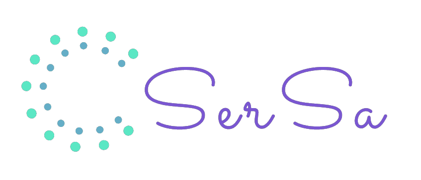

# start-game

**A React application that is a simple game with the webpack, babel, pre-configured to get the job started faster.**

## Dependencies

### Install dependencies

> npm install

#### Buid with Webpack

> npm run webpack

#### Running project on development

> npm start

After the command your application should start right in your default browser at localhost:8008, if you need change the port go to the file `webpack.config.js`
